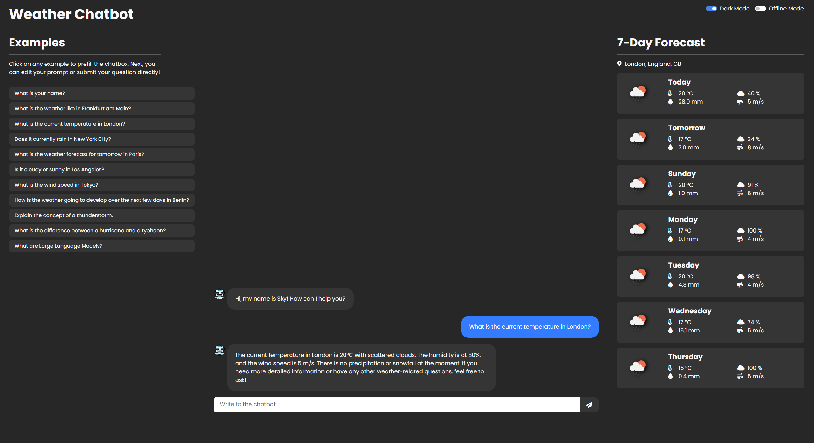

<br />
<div align="center">
  
  <h1>Project: AI Use Case - Weather Chatbot</h1>
</div>



## Description

This is a weather chatbot that uses the [LangChain](https://python.langchain.com/v0.2/docs/introduction/) library, the
[OpenAI](https://platform.openai.com/docs/api-reference/introduction) API and the
[OpenWeatherMap](https://openweathermap.org/api) API to generate responses to weather-related user queries. A user
interface is provided by a [Dash](https://dash.plotly.com/tutorial) web application that allows users to chat with the
chatbot intuitively without any manual installations. The chatbot has been deployed on [Render](https://render.com/)
and can be accessed online by visiting [iu-weather-chatbot.onrender.com](https://iu-weather-chatbot.onrender.com).


## Web UI (recommended)

No manual installation is required, and you can start chatting immediately! <br>
You can visit the online chatbot here: [iu-weather-chatbot.onrender.com](https://iu-weather-chatbot.onrender.com)

> [!TIP]
> When accessing the online chatbot after a longer period of inactivity, you may need to wait for the
> server to start up. This can take up to 2 minutes. Therefore, please be patient and wait for the website to load.
> 
> For the best experience, use the chatbot on a desktop or laptop. Even though the chatbot is mobile-friendly,
> the UI is optimized for larger screens and some features are disabled to fit the smaller screen size of mobile
> devices.


## Manual Installation

Download the contents of the chatbot repository or clone it using the following command:

```bash 
git clone https://github.com/chris-official/chatbot.git
cd chatbot
```

It is recommended to use `Python=3.12`. However, `Python>=3.10` may also work but has not been tested.
Create a new virtual environment and activate it:
    
```bash
python -m venv chatbot_env
chatbot_env/Scripts/activate.bat
```

Alternatively, you can use `conda` to create a new environment:

```bash
conda create --name chatbot_env python=3.12.4
conda activate chatbot_env
```

Install the required dependencies:

```bash
pip install -r requirements.txt
```

Open the `.env` file and add your OpenAI and OpenWeatherMap API key. You can get your OpenAI key
[here](https://platform.openai.com/api-keys) and your OpenWeatherMap key
[here](https://home.openweathermap.org/api_keys). Finally, the file should look like this:

```bash
OPENAI_API_KEY="your_openai_api_key"
OPENWEATHERMAP_API_KEY="your_openweathermap_api_key"
```

To start the chatbot interface on your machine, run `app.py` by executing the following command:

```bash
python app.py
```

This will initiate a local server at [`http://127.0.0.1:8050`](http://127.0.0.1:8050).
To start chatting with the chatbot, simply open this URL in your browser.

> [!WARNING]
> When no API keys are provided, the chatbot will automatically start in offline mode and will not make any API calls.
> Instead, a default response will be displayed. For the chatbot to work properly, you must provide the API keys or
> visit the online chatbot.


## Features

The chatbot provides following functionalities:
1. **Weather Information**: The chatbot can provide the current weather information and the weather forecasts for the
next 7 days for a specific city. This includes the temperature, humidity, wind speed, cloudiness, UV index, and
precipitation. This information is retrieved in real-time from the OpenWeatherMap API.
2. **Weather-related Queries**: The chatbot can also answer more general weather-related queries based on the LLMs
foundational knowledge.
3. **Offline Mode**: When the chatbot is set up locally and no API keys are provided, the chatbot will run in offline
mode and will not make any API calls. However, chat functionality is still available for testing purposes.
4. **Conversation Memory**: The chatbot remembers the last 4 chat messages and can use them to generate more
contextually relevant responses.

The UI offers four features:
1. **Chat Interface**: The chat interface (middle) allows users to interact with the chatbot and displays the chat
history. The chatbot can be reset at any time by refreshing the page.
2. **Prompt Examples**: The examples column (left) provides some example prompts that users can ask the chatbot by
simply clicking on them and submitting the query. This column is hidden on mobile devices.
3. **Weather Information**: The weather information column (right) summarizes the requested weather information for the
specified location for the next 7 days. The information is updated automatically as soon as the user interacts with the
chatbot. This column is hidden on mobile devices.
4. **Theme Switch**: The theme switch button in the top right corner allows users to switch between light and dark mode.

> [!NOTE]
> The Prompt Examples and Weather Information columns are hidden on mobile devices to provide a better user experience
> on smaller screens.


## Example

1. Select a prompt from the examples column or type a query in the chat interface. Your prompt should be a general
weather-related question or address the weather in a specific location determined by the city name. In case of an
ambiguous city name, you may need to provide the country or state as well. Otherwise, the chatbot will choose one
location. The selected location is displayed at the top of the weather information column as soon as the chatbot has
made a successful API call.
2. Press the "Send" button or hit "Enter" to submit your query.
3. Wait for the chatbot to generate a response.
4. Keep the conversation going by asking more questions!


## Troubleshooting

If you encounter any server related issues (Error code: 5XX), please check the server status on the
[Render Status Page](https://status.render.com) for any ongoing incidents and try again later.


## License

This project was developed as part of the course "Project: AI Use Case" at the International University of 
Applied Sciences (IU).


## References

* [Dash Bootstrap Components](https://dash-bootstrap-components.opensource.faculty.ai/docs/)
* [Dash Chatbot Example](https://github.com/plotly/dash-sample-apps/tree/main/apps/dash-gpt3-chatbot)
* [Google Fonts](https://fonts.google.com/specimen/Poppins)
* [LangChain Custom Tools](https://python.langchain.com/v0.2/docs/how_to/custom_tools/)
* [LangChain OpenWeatherMap Tool](https://python.langchain.com/v0.2/docs/integrations/tools/openweathermap/)
* [LangChain OpenWeatherMap Wrapper](https://python.langchain.com/v0.2/docs/integrations/providers/openweathermap/)
* [LangChain Tool Calling Agents](https://python.langchain.com/v0.1/docs/modules/agents/agent_types/tool_calling/)
* [OpenWeatherMap API Docs](https://openweathermap.org/api/one-call-3)
* [OpenWeatherMap Geocoding API](https://openweathermap.org/api/geocoding-api)
* [OpenWeatherMap Weather Condition Icons](https://openweathermap.org/weather-conditions)
* [PyOWM Docs](https://pyowm.readthedocs.io/en/latest/v3/code-recipes.html)
* [PyOWM GitHub](https://github.com/csparpa/pyowm)
* [Render Dashboard](https://dashboard.render.com)
* [Render Web Service](https://docs.render.com/web-services)
* [Robot Icon](https://cdn-icons-png.flaticon.com/512/3398/3398643.png)
